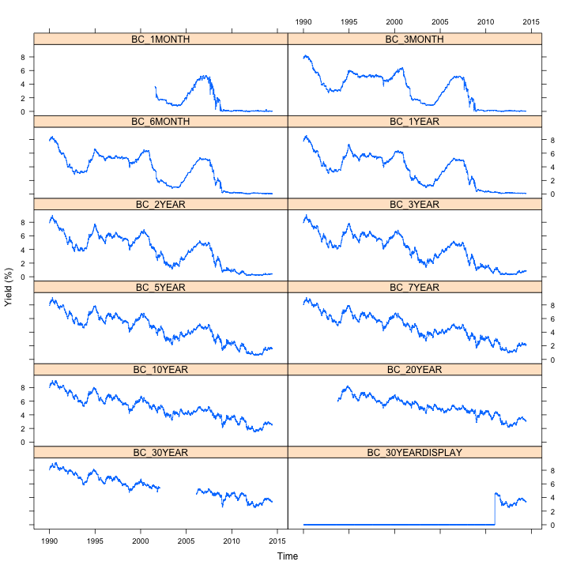
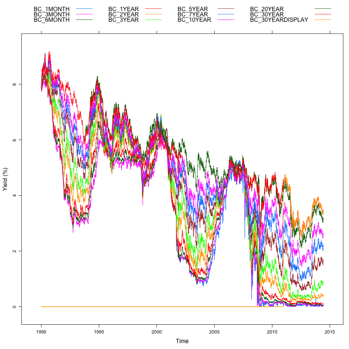
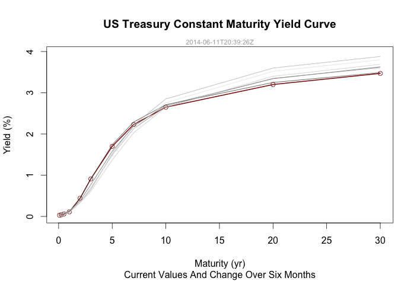

[](https://travis-ci.org/mrbcuda/ustyc)

US Treasury Yield Curve 
=======================

[Now on CRAN](http://cran.r-project.org/web/packages/ustyc/index.html).

The main function in this R package forms a query to submit for US Treasury yield curve data, posting this query to the US Treasury web site's data feed service.  By default the download includes data yield data for 12 products from January 1, 1990, some of which are NA during this span.  The caller can pass parameters to limit the query to a certain year or year and month, but the full download is not especially large.  The download data from the service is in XML format.  This function transforms that data into a numeric data frame with treasury product items (constant maturity yields for 12 kinds of bills, notes, and bonds) as columns and dates as row names. The function returns a list which includes an item for this data frame as well as query-related values for reference and the update date from the service.  The data frame can be used as-is or converted easily to a time series format such as ```xts```. 

```{r}
require(ustyc)
yc <- getYieldCurve()
summary(yc)
head(yc$df)
```

The data frame might be converted to ```xts``` and plotted for example with ```lattice```:

```{r}
require(xts)
require(lattice)

xt = xts(yc$df,order.by=as.Date(rownames(yc$df)))
xyplot.ts(xt,scales=list(y=list(relation="same")),ylab="Yield (%)")
```



```{r}
xyplot.ts(xt,superpose=TRUE,auto.key=list(columns=4),ylab="Yield (%)")
```



One way to view the changes over time leading to the most recent entry:

```{r}
treasury.maturity <- c(1/12,3/12,6/12,1,2,3,5,7,10,20,30)
mv = max(tail(yc$df,n=180))
g <- gray.colors(6,start=0.3,end=0.9,gamma=2.2)

plot(treasury.maturity,
     yc$df[nrow(yc$df),-12],
     type="l",
     main="US Treasury Constant Maturity Yield Curve",
     sub="Current Values And Change Over Six Months",
     xlab="Maturity (yr)",
     ylab="Yield (%)",
     lwd=2,
     ylim=c(0.0,mv),
     col="darkred")

points(treasury.maturity,
       as.numeric(yc$df[nrow(yc$df),-12]),
       col="darkred")

for ( i in 1:6 ) {
  lines(treasury.maturity,
        as.numeric(yc$df[nrow(yc$df)-i*30,-12]),
        type="l",
        col=g[i])
}

mtext(yc$updated,side=3,col="darkgray",cex=0.7)

```




References:
* [US Treasury Feed Service](http://data.treasury.gov/feed.svc/DailyTreasuryYieldCurveRateData)
